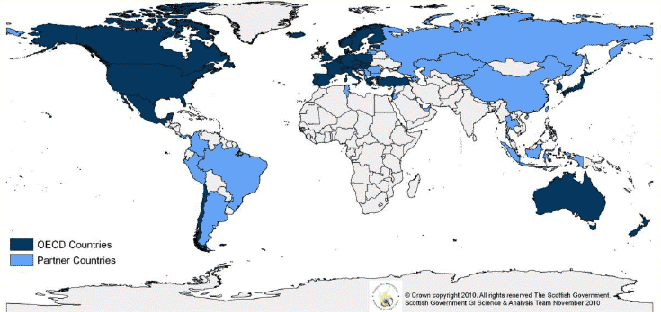
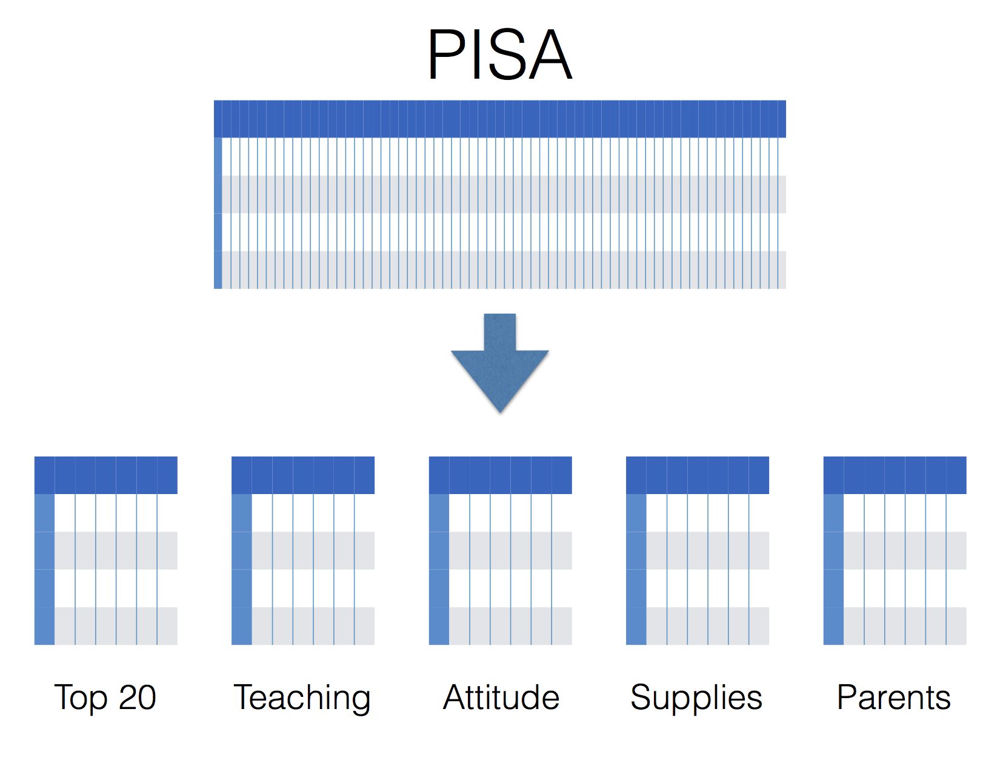

```{r, echo=FALSE}
library(knitr)
knitr::knit_hooks$set(inline = as.character)
knitr::opts_chunk$set(cache=T, echo = F, fig.height = 5, results="hide", message=F)
knitr::opts_knit$set(eval.after = 'fig.cap')
```

```{r sources}
for(f in paste("../R/", c(
  "student",
  "issue",
  "subsets",
  "explore",
  "supervised"
), ".R", sep=""))
  source(f)
```


## 2012 PISA data

- Take students with top 25\% and low 25\% mean test scores.
- Response = high vs low score.
- Which key factors predict success?
- What is the next step for policy?




## Top individual survey questions

```{r usaattitude}
#matching.dot.plot(country = "USA", "top_20")

  country = "USA"
  .issue = "top_20"

  library(ggplot2)
  lst = getSubset(country = country, .issue = .issue)
  d = lst$dictionary

  pattern = "Math Anxiety - |Perceived Control - |Vignette Teacher Support - |Student Orientation - |Formative Assessment - |Vignette Classroom Management - Student-Teacher Relation - |Vignette Classroom Management - |Teacher-Directed Instruction - |Student-Teacher Relation - |Classroom Management - |Disciplinary Climate - "

  d$Description = gsub(pattern, "", d$Description)
  d$Description = gsub("Gives Feedback on Strengths and Weaknesses", "Feedback (strengths, weaknesses)", d$Description)
  d$Description = gsub("Differentiates Between Students When Giving Tasks", "Differentiates (Giving Tasks)", d$Description)
  d$Description = gsub("Homework Once a Week/Not Back in Time", "Weekly homework/back on time", d$Description)
  d$Description = gsub("Students Are Calm/Teacher Arrives on Time", "Students calm/teacher on time", d$Description)
  d$Description = gsub("Teacher Has to Wait Until its Quiet", "Delay until quiet", d$Description)
  d$Description = gsub("Math Self-Concept - ", "Math belief: ", d$Description)
  d$Description = gsub("Perform Poorly Regardless", "Hopeless Despite Effort", d$Description)
  d$Description = gsub("Attitude towards School - Does Little to Prepare Me for Life", "Attitude: does not prepare for life", d$Description)

  d$Factor = ordered(d$Factor, rev(d$Factor))
  d$Description = ordered(d$Description, rev(d$Description))

  d = d[1:10, ]

  pl = ggplot(d) + geom_point(aes_string(x = "Matching", y = "Description")) + 
    xlab("\n Matching score") + ylab("Description\n") + 
    theme(axis.text.x = element_text(angle = -90, hjust = -.01, vjust = .5, size = 20),
               axis.text.y = element_text(size = 20), 
               axis.title=element_text(size=20),
               plot.title = element_text(size = 20))  + labs(title = "USA")
  pl
```

## Top teaching variables

```{r usateaching}
#matching.dot.plot(country = "USA", .issue = "teaching")

country = "USA"
.issue = "teaching"

 library(ggplot2)

  lst = getSubset(country = country, .issue = .issue)

  d = lst$dictionary
 
  pattern = "Vignette Teacher Support - |Student Orientation - |Formative Assessment - |Vignette Classroom Management - Student-Teacher Relation - |Vignette Classroom Management - |Teacher-Directed Instruction - |Student-Teacher Relation - |Classroom Management - |Disciplinary Climate - "

  d$Description = gsub(pattern, "", d$Description)
  d$Description = gsub("Gives Feedback on Strengths and Weaknesses", "Feedback (strengths, weaknesses)", d$Description)
  d$Description = gsub("Differentiates Between Students When Giving Tasks", "Differentiates (Giving Tasks)", d$Description)
  d$Description = gsub("Homework Once a Week/Not Back in Time", "Weekly homework/back on time", d$Description)
  d$Description = gsub("Students Are Calm/Teacher Arrives on Time", "Students calm/teacher on time", d$Description)
  d$Description = gsub("Teacher Has to Wait Until its Quiet", "Delay until quiet", d$Description)
    
  d$Factor = ordered(d$Factor, rev(d$Factor))
  d$Description = ordered(d$Description, rev(d$Description))

  d = d[1:10, ]

  pl = ggplot(d) + geom_point(aes_string(x = "Matching", y = "Description\n")) + xlab("\n Matching score") + 
    theme(axis.text.x = element_text(angle = -90, hjust = -.01, vjust = .5, size = 20),
               axis.text.y = element_text(size = 20), 
               axis.title=element_text(size=20),
               plot.title = element_text(size = 20)) + labs(title = "USA")
  pl
```

## 

```{r usamatchissue, fig.height = 6}
# plot.matching.by.issue()

country = "USA"

 library(ggplot2)
  library(plyr)

  lst = student(country)
  d = lst$dictionary

  order.by.issue = ddply(d, "Issue", function(df){
    data.frame(Issue = df$Issue[1], Matching = quantile(df$Matching, 0.75))
  })


  cIssue = as.character(d$Issue)
  obi = as.character(order.by.issue$Issue)
  

  cIssue = gsub("gender", "Gender", cIssue)
  cIssue = gsub("sociality", "Sociality", cIssue)
  cIssue = gsub("teaching", "Teaching", cIssue)
  cIssue = gsub("attitude-interest", "Attitude", cIssue)
  cIssue = gsub("school.possessions", "Supplies", cIssue)
  cIssue = gsub("possessions.not.school", "Possessions", cIssue)
  cIssue = gsub("attendance-truancy-repeat", "Attendance", cIssue)
  cIssue = gsub("course.content", "Course Content", cIssue)
  cIssue = gsub("parent.backgrounds", "Parents", cIssue)
  cIssue = gsub("family.at.home", "Family at Home", cIssue)
  cIssue = gsub("learning-strategies", "Learning Strategies", cIssue)
  
  cIssue = gsub("math-behavior", "Math Behavior", cIssue)
  cIssue = gsub("international-language", "International", cIssue)
  cIssue = gsub("study-learn.outside.school", "Outside School", cIssue)
  cIssue = gsub("age", "Age", cIssue)

  obi = gsub("gender", "Gender", obi)
  obi = gsub("sociality", "Sociality", obi)
  obi = gsub("teaching", "Teaching", obi)
  obi = gsub("attitude-interest", "Attitude", obi)
  obi = gsub("school.possessions", "Supplies", obi)
  obi = gsub("possessions.not.school", "Possessions", obi)
  obi = gsub("attendance-truancy-repeat", "Attendance", obi)
  obi = gsub("course.content", "Course Content", obi)
  obi = gsub("parent.backgrounds", "Parents", obi)
  obi = gsub("family.at.home", "Family at Home", obi)
  obi = gsub("learning-strategies", "Learning Strategies", obi)
  
  obi = gsub("math-behavior", "Math Behavior", obi)
  obi = gsub("international-language", "International", obi)
  obi = gsub("study-learn.outside.school", "Outside School", obi)
  obi = gsub("age", "Age", obi)

#  nc = 12
#  cIssue = substr(cIssue, 0, nc)
#  obi = substr(obi, 0, nc)
  
#  cIssue = paste(cIssue, ifelse(nchar(as.character(d$Issue)) > nc, "...", ""), sep="")
#  obi = paste(obi, ifelse(nchar(as.character(order.by.issue$Issue)) > nc, "...", ""), sep="")
  
  d$Issue = ordered(cIssue, levels = obi[order(order.by.issue$Matching)])

  ggplot(d) + geom_boxplot(aes(x = Issue, y = Matching), outlier.size = 0) + 
  geom_jitter(aes(x = Issue, y = Matching), alpha = 0.5) + 
  theme_bw() + 
  theme(axis.text.x = element_text(angle = -90, hjust = -.01, vjust = .5, size = 20),
             axis.text.y = element_text(size = 20), 
             axis.title=element_text(size=20),
             plot.title = element_text(size = 20)) + 
  ylab("Matching score\n")+ xlab("") + labs(title = country)
```


## 



##

```{r usaerr, fig.height = 6}
country = countries = "USA"

library(ggplot2)
	df = data.frame(Rate = c(), Method = c(), Issue = c(), Country = c())
      issues = issues.for.country(country)
      f = paste("../cache/rate_", country, "_", paste(issues, collapse = "_"), ".rds", sep = "")

	  if (file.exists(f)) {
	    rate = readRDS(f)
	  } else {
		rate = data.frame(Rate = c(), Method = c(), Issue = c(), Country = c())
		for (i in issues) {
		  e = class.rates(country, i)
		  rate = rbind(rate, data.frame(Rate = e, Method = names(e), Issue = i, Country = country))
		}
		saveRDS(rate, f)
	  }

      df = rbind(df, rate)

mtd = as.character(df$Method)
mtd = gsub("neuralNet", "nnet", mtd)

iss = as.character(df$Issue)
iss = gsub("top_20", "Top 20", iss)
iss = gsub("teaching", "Teaching", iss)
iss = gsub("parent.backgrounds", "Parents", iss)
iss = gsub("attitude-interest", "Attitude", iss)
iss = gsub("school.possessions", "Supplies", iss)

df$Method = mtd
df$Issue = iss

df$Issue = ordered(df$Issue, levels = c("Top 20", "Teaching", "Attitude", "Supplies", "Parents"))

 ggplot(df) + geom_line(aes(x = Method, y = Rate, group = Issue, color = Issue)) +
      theme_bw() + 
	  theme(axis.text.x = element_text(angle = -90, hjust = -0.01, vjust = 0.5, size = 16),
                     axis.text.y = element_text(size = 20),
                     axis.title=element_text(size=20),
                     plot.title = element_text(size = 20),
                     legend.title = element_text(size = 20),
                     legend.text = element_text(size = 16)) + 
	  ylab("Test rate (correct)\n") + xlab("\n Classifiier")

```

##

```{r intlerr, fig.height = 6}
countries = c("USA", "Japan", "Germany", "Peru")
 
 
 	library(ggplot2)
	df = data.frame(Rate = c(), Method = c(), Issue = c(), Country = c())

	for (country in countries) {
      issues = issues.for.country(country)
      f = paste("../cache/rate_", country, "_", paste(issues, collapse = "_"), ".rds", sep = "")

	  if (file.exists(f)) {
	    rate = readRDS(f)
	  } else {
		rate = data.frame(Rate = c(), Method = c(), Issue = c(), Country = c())
		for (i in issues) {
		  e = class.rates(country, i)
		  rate = rbind(rate, data.frame(Rate = e, Method = names(e), Issue = i, Country = country))
		}
		saveRDS(rate, f)
	  }

      df = rbind(df, rate)
	}


mtd = as.character(df$Method)
mtd = gsub("neuralNet", "nnet", mtd)

iss = as.character(df$Issue)
iss = gsub("top_20", "Top 20", iss)
iss = gsub("teaching", "Teaching", iss)
iss = gsub("parent.backgrounds", "Parents", iss)
iss = gsub("attitude-interest", "Attitude", iss)
iss = gsub("school.possessions", "Supplies", iss)
iss = gsub("study-learn.outside.school", "Outside School", iss)
iss = gsub("course.content", "Course Content", iss)
iss = gsub("international-language", "International", iss)
iss = gsub("attendance-truancy-repeat", "Attendance", iss)

df$Method = mtd
df$Issue = iss

     df = subset(df, !(Issue %in% c("Top 20")))
     df$Issue = factor(as.character(df$Issue), levels = unique(as.character(df$Issue))) 

 ggplot(df) + geom_line(aes(x = Country, y = Rate, group = Method)) +
      geom_point(aes(x = Country, y = Rate), alpha = 0.5) +
      geom_boxplot(aes(x = Country, y = Rate), color = "blue", alpha = 0.5, outlier.size = 0) +
      theme_bw() + 
      facet_wrap(~Issue) + 
      xlab("\nCountry") +
      ylab("Test rate (correct)\n") +
      theme(axis.text.x = element_text(angle = -90, hjust = -0.01, vjust = 0.5, size = 16), 
                 axis.text.y = element_text(size = 12),
                 strip.text = element_text(size = 16),
                 axis.title=element_text(size=20),
                 plot.title = element_text(size = 20))
```
 
